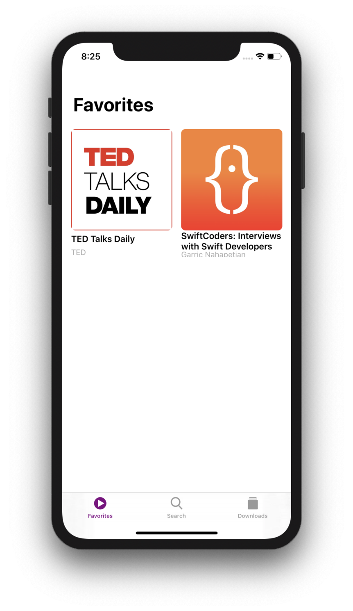
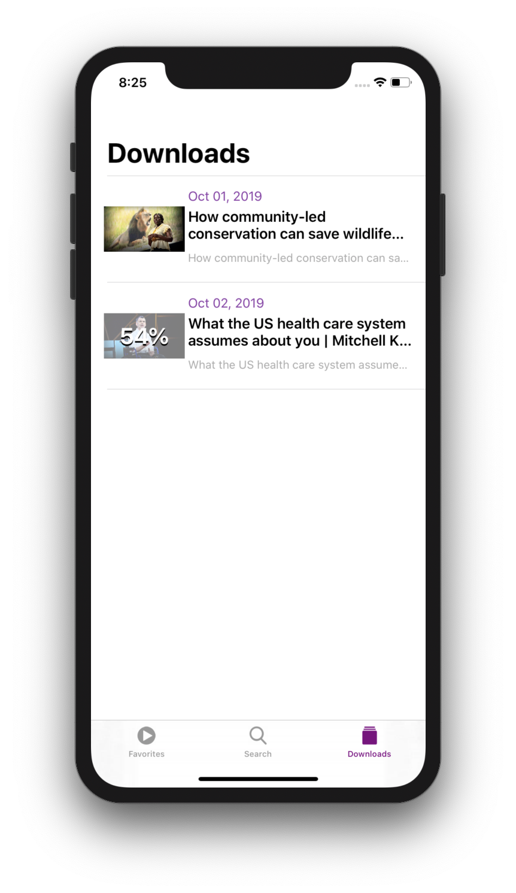
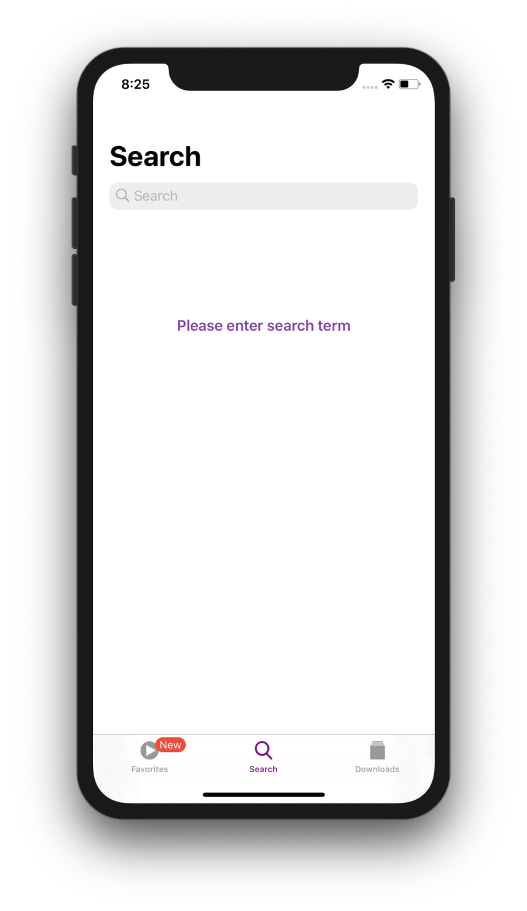
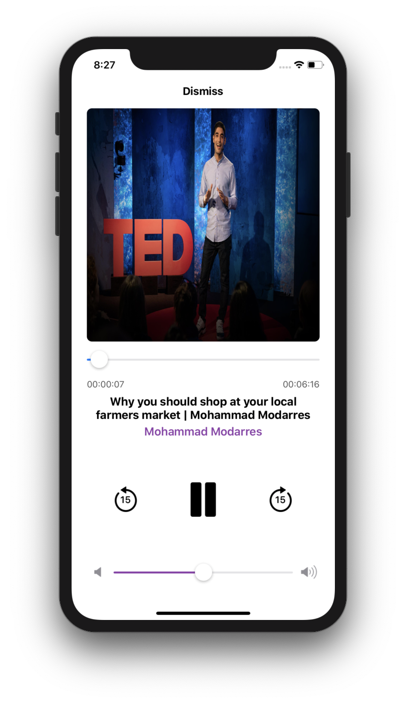
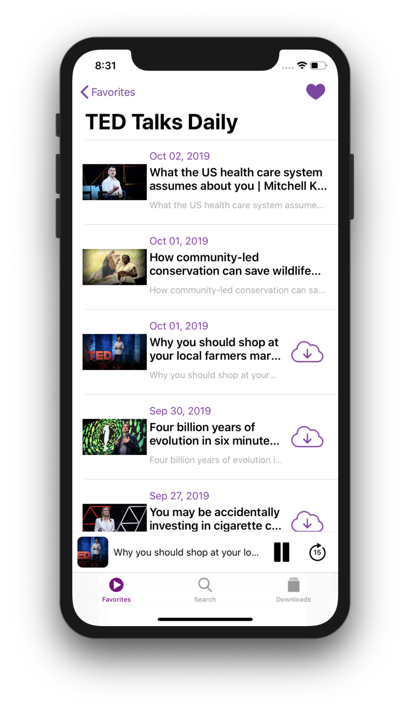

# PodcastsApp
Trying to recreate Podcasts App by Apple to listen podcasts from iTunes API providing by Apple.
It allows you to listen any podcast and save it as favourite. You also could download episodes and play them without Internet connection. 
You can control player in command center or on locked screen.

### Techonologies
 - Alamofire for parsing JSON API
 - FeedKit for RSS data
 - AVKit 
 - MediaPlayer
 - UI written by XIB and AutoLayout
 
### Screenshots 
 

